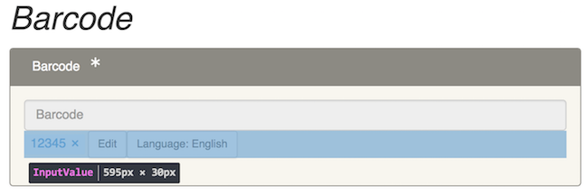

## React

An open-source project sponsored by [Facebook](https://facebook.com),
[React][REACT] is a Javascript module for building user interfaces. Early on,
Sinopia adopted [React][REACT] as a way to dynamically generate the HTML
elements for creating and editing linked data.

### Components
Most of the [React][REACT] components in Sinopia are pure functions that either
generate HTML elements, css classes, and behavior or provide a collection-level
container for other React components. For example the `InputValue` component,
pictured below

The source code for this component is available at
[https://github.com/LD4P/sinopia_editor/blob/master/src/components/editor/property/InputValue.jsx](https://github.com/LD4P/sinopia_editor/blob/master/src/components/editor/property/InputValue.jsx)

In this code snippet from that file, shows the `InputValue`
component being defined as a `const` with an important data structure `props` that are properties
of the component. The next two lines set two constants, `isLiteral` and `label`
that are themselves one-line functions that return conditional values when called
by the component. Similarly, the `const handleEditClick` wraps two function calls
that change the language and remove an item.

<pre class="prettyprint lang-js" style="font-size: 1.25em;">
const InputValue = (props) => {
  const isLiteral = typeof props.item.content !== 'undefined'
  const label = isLiteral ? props.item.content : props.item.uri

  const handleEditClick = () => {
    props.handleEdit(label, props.item.lang)
    props.removeItem(props.reduxPath)
  }
</pre>

  Next these functions are tied and rendered in HTML with the **return** statement
  below:

<pre class="prettyprint lang-js" style="font-size: 1.25em;">
  return (&lt;div id="userInput"&gt;
    &lt;div
      className="rbt-token rbt-token-removeable"&gt;
      {label}
      &lt;button
        onClick={() => props.removeItem(props.reduxPath)}
        className="close rbt-close rbt-token-remove-button"&gt;
        &lt;span aria-hidden="true"&gt;×&lt;/span&gt;
      &lt;/button&gt;
    &lt;/div&gt;
    &lt;button
      id="editItem"
      onClick={handleEditClick}
      className="btn btn-sm btn-literal btn-default"&gt;
      Edit
    &lt;/button&gt;
    { isLiteral ? (&lt;LanguageButton reduxPath={props.reduxPath}/&gt;) : '' }
  &lt;/div&gt;)
}
</pre>

[REACT]: https://reactjs.org/
