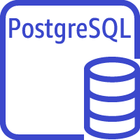

### Amazon Web Services
## Relational Database Service (RDS)
Sinopia server uses a variant of [Trellis][TRELLIS] Linked Data Platform that
uses a PostgresSQL relational database to store the RDF and JSON payloads instead
of a RDF Triplestore .

[TRELLIS]: https://www.trellisldp.org/
