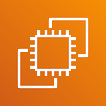

# Amazon EC2

The other method we use to run a [Docker][DOCK] image is by hosting as part of
a virtual machine running as a [EC2][EC2] Docker container. When we started
Sinopia, [Fargate][FAR] does not persist data so we could not mount a permanent
disk volume to store the RDF entities [Memento](https://tools.ietf.org/html/rfc7089)
metadata as needed by our Linked Data Platform, [Trellis][TRELLIS].

[Top](#)

[DOCK]: https://docker.io
[EC2]: https://aws.amazon.com/ec2/
[ECS]: https://aws.amazon.com/ecs/
[FAR]: https://aws.amazon.com/fargate/
[TRELLIS]: https://www.trellisldp.org/
