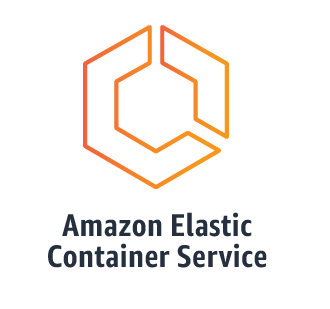

### Amazon Web Services
## Elastic Container Service
The deployment of Sinopia on AWS relies on pre-built Docker images hosted on
[DockerHub](https://hub.docker.com/) that are then run in a [Elastic Container Service][ECS]
(ECS) cluster. Sinopia is run on three [ECS][ECS] clusters; development, staging, and
production with corresponding Docker images for each environment. 

### Fargate

### Amazon EC2

[ECS]: https://aws.amazon.com/ecs/
