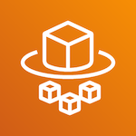

## Amazon Web Services
# Fargate

[Fargate][FAR] is an AWS service that runs [Docker][DOCK] containers in a state-less
fashion within a Virtual Elastic cluster. A [Docker][DOCK] container is a lightweight isolated 
Linux executable package of software that is generated in a deterministic way from a [Docker][DOCK]
image.

In Sinopia, we run the following Docker Images as [Fargate][FAR] tasks:

- Sinopia Linked Data Editor [Docker image](https://hub.docker.com/r/ld4p/sinopia_editor)
- Sinopia Profile Editor [Docker image](https://hub.docker.com/r/ld4p/sinopia_profile_editor/)
- Sinopia Indexing Pipeline [Docker image](https://hub.docker.com/r/ld4p/sinopia_indexing_pipeline)
- Sinopia ACL [Docker image](https://hub.docker.com/r/ld4p/sinopia_acl)

[Top](#)

[DOCK]: https://docker.io
[EC2]: https://aws.amazon.com/ec2/
[ECS]: https://aws.amazon.com/ecs/
[FAR]: https://aws.amazon.com/fargate/
[TRELLIS]: https://www.trellisldp.org/
